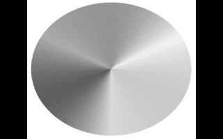
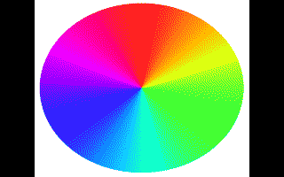
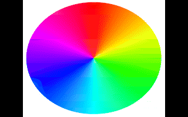
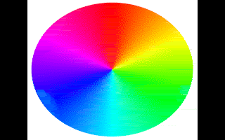

# image2shr

Convert modern images (PNG, JPEG, GIF, BMP) into Apple IIgs Super Hi-Res
files — from the command line, with no dependencies, deterministically.

Built for two consumers:

- **Pipelines** — Makefiles and shell scripts in IIgs game/demo development.
  Quiet by default, useful exit codes, byte-identical output for identical
  inputs and flags.
- **UI front-ends** — a GUI can shell out to this binary: stdout carries only
  the payload (binary or `--json`), everything else goes to stderr, and
  `preview` renders any SHR file to PNG exactly as the IIgs would display it.

Written in Go, standard library only. Licensed GPL-3.0.

## Samples

Wikimedia Commons'
[Gradient_color_wheel.png](https://commons.wikimedia.org/wiki/File:Gradient_color_wheel.png)
(CC0), converted with each target's defaults and previewed back to PNG —
every image below is a pixel-exact rendering of what the IIgs displays:

```sh
curl -LO https://commons.wikimedia.org/wiki/Special:FilePath/Gradient_color_wheel.png
image2shr convert -t shr320-grey16    -o wheel-grey16.shr    Gradient_color_wheel.png
image2shr convert -t shr320-color16   -o wheel-color16.shr   Gradient_color_wheel.png
image2shr convert -t shr320-color256  -o wheel-color256.shr  Gradient_color_wheel.png
image2shr convert -t shr320-color3200 -o wheel-color3200.3200 Gradient_color_wheel.png
image2shr preview wheel-grey16.shr    -o wheel-grey16.png
image2shr preview wheel-color16.shr   -o wheel-color16.png
image2shr preview wheel-color256.shr  -o wheel-color256.png
image2shr preview wheel-color3200.3200 -o wheel-color3200.png
```

| `shr320-grey16` | `shr320-color16` | `shr320-color256` | `shr320-color3200` |
|-----------------|------------------|-------------------|--------------------|
|  |  |  |  |
| 16 greys | one 16-color palette | 16 palettes, switched per scanline | a palette per scanline (Brooks) |

## Build

```sh
make build          # → bin/image2shr
make test           # run all tests
make lint           # gofmt + go vet
make cross          # dist/ binaries for darwin/linux/windows × amd64/arm64
```

## Usage

```sh
# Convert with defaults (target shr320-grey16, Floyd–Steinberg dither):
image2shr convert photo.png                    # writes photo.shr

# Everything explicit:
image2shr convert -o title.shr -t shr320-grey16 \
    --dither floyd-steinberg --dither-strength 0.8 --serpentine \
    --fit cover --aspect correct --luma rec709 title.jpg

# Multi-palette color (16 palettes, palette switches placed adaptively):
image2shr convert -t shr320-color256 photo.jpg
image2shr convert -t shr320-color256 --scb-mode per-line photo.jpg

# See what the IIgs will display, before ever leaving your desk:
image2shr preview title.shr -o check.png
image2shr preview title.shr -o big.png --size 640 --scale 2

# Or get the preview in the same run:
image2shr convert --preview-png check.png -o title.shr title.jpg

# Inspect any raw SHR file:
image2shr inspect title.shr
image2shr inspect --json title.shr

# List conversion targets:
image2shr targets

# Fully piped:
cat in.png | image2shr convert -o - - > out.shr

# Machine-readable result for tooling (payload goes to the file):
image2shr convert --json -o out.shr in.png

# ProDOS metadata for Cadius / CiderPress:
image2shr convert --sidecar -o out.shr in.png   # also writes out.shr.meta.json
```

Run `image2shr <command> --help` for every flag with examples.

### Exit codes

| Code | Meaning |
|------|---------|
| 0    | success |
| 1    | runtime failure (bad input file, unimplemented algorithm, I/O error) |
| 2    | usage error (unknown flag/value, missing argument) |

### Machine interface guarantees

- stdout is payload-only: the converted bytes (`-o -`), or the `--json`
  object. Logs, warnings, and progress go to stderr.
- Same input + same flags + same version ⇒ byte-identical output.
- `--json` reports input dimensions, resolved options, output size, ProDOS
  file type/auxtype, palettes used, per-line palette assignments, timing,
  and a warnings array.

## Output formats

| `--format` | Contents | ProDOS type/aux | Status |
|------------|----------|-----------------|--------|
| `raw`      | 32,768-byte uncompressed screen dump | PIC `$C1`/`$0000` | ✔ |
| `packed`   | PackBytes-compressed screen | PNT `$C0`/`$0001` | stub |
| `apf`      | Apple Preferred Format (block-structured) | PNT `$C0`/`$0002` | stub |
| `brooks`   | Brooks 3200-color (38,400 bytes, 200 per-line palettes) | PIC `$C1`/`$0002` | ✔ |

`--format` defaults to `auto`: `raw`, or `brooks` for 3200-color frames —
which also picks the `.3200` output extension when `-o` is omitted. Any
target can be forced to `brooks`; its palettes are expanded per line.

## Targets

| Target | Geometry | Description |
|--------|----------|-------------|
| `shr320-grey16` | 320×200 | greyscale, single 16-grey palette, all SCBs `$00` |
| `shr320-color16` | 320×200 | color, single adaptive 16-color palette (perceptual Oklab clustering), all SCBs `$00` |
| `shr320-color256` | 320×200 | color, up to 16 adaptive 16-color palettes assigned per scanline; `--scb-mode` picks the strategy: `grouped` (default — contiguous bands with adaptively placed palette switches), `banded` (16 fixed bands), `per-line` (fully dynamic line clustering), `single` |
| `shr320-color3200` | 320×200 | color, one adaptive 16-color palette per scanline (Brooks 3200-color, `.3200` file) |

More targets (640 mode) plug into the same pipeline; see
`docs/ARCHITECTURE.md` for where.

## Documentation

- `docs/SPEC.md` — the project brief and SHR hardware reference (byte
  layouts, SCB bits, the 640-mode pixel-position palette mapping).
- `docs/ARCHITECTURE.md` — pipeline stages and extension points.

## License

GPL-3.0 — see `LICENSE`.
